# qlib/data Architecture & Key Patterns

## Core Architecture Patterns

### 1. Provider Pattern (3-tier)

Every data domain has the same abstract → local → client hierarchy:

```
Abstract Base (CalendarProvider, FeatureProvider, ExpressionProvider, …)
    ↓
LocalXxxProvider  — reads from disk on single machine
ClientXxxProvider — delegates over SocketIO to a remote server
```

All providers are registered as global singletons (`Cal`, `Inst`, `FeatureD`, `ExpressionD`, `DatasetD`, `D`) via config, so user code just calls `D.features(...)` without knowing whether data is local or remote.

### 2. Expression as Lazy Computation

`qlib/data/base.py` defines `Expression` as an abstract lazy node. Expressions are composed via Python operator overloading and only compute when `.load()` is called:

```python
# Building: no computation yet
expr = (Feature("close") - Mean(Feature("close"), 5)) / Std(Feature("close"), 5)

# Computing: triggers recursive load + cache
series = expr.load(instrument, start_idx, end_idx, freq)
```

`qlib/data/ops.py` has 40+ operators (rolling, element-wise, pair-wise, cross-sectional).

### 3. Multi-Layer Caching

`qlib/data/cache.py` implements three levels:

| Level | Class | What it caches |
|---|---|---|
| **Memory** | `MemCache` (keyed in `H["f"]`) | Expression results (LRU, cleared at session end) |
| **Disk (Expression)** | `DiskExpressionCache` | Intermediate computed expressions (`.data`/`.index`/`.meta`) |
| **Disk (Dataset)** | `DiskDatasetCache` | Full assembled datasets (HDF5/pickle) |

### 4. Storage Abstraction

`qlib/data/storage/` defines three storage interfaces:

- `CalendarStorage` — list-like interface for trading dates
- `InstrumentStorage` — dict of instruments with time spans
- `FeatureStorage` — slice-based time-series access

File implementations (`FileFeatureStorage`, etc.) are auto-wired via `ProviderBackendMixin` — the provider name determines the storage class from config.

### 5. Dataset Handler Pipeline (Two-Phase)

`qlib/data/dataset/handler.py` — data goes through:

1. **Load phase**: `DataLoader` (QlibDataLoader, StaticDataLoader, NestedDataLoader) fetches raw `(datetime, instrument)` multi-indexed DataFrame
2. **Process phase**: chained `Processor` objects transform it in-place (`ZScoreNorm`, `Fillna`, `DropnaProcessor`, `CSRankNorm`, …)

---

## Key Files at a Glance

| File | Role |
|---|---|
| `qlib/data/data.py` | Provider base classes + local/client implementations (49KB, the core) |
| `qlib/data/base.py` | `Expression`, `Feature`, `PFeature` abstract nodes |
| `qlib/data/ops.py` | All expression operators (rolling, math, cross-sectional) |
| `qlib/data/cache.py` | Three-tier caching system (47KB) |
| `qlib/data/pit.py` | Point-in-time DB: `PFeature` (`$$field`) and period-to-date collapse |
| `qlib/data/client.py` | SocketIO client for remote provider mode |
| `qlib/data/filter.py` | Dynamic instrument filtering (expression-based, name-based) |
| `qlib/data/storage/` | Abstract storage interfaces + file-based implementations |
| `qlib/data/dataset/` | DataHandler, DataLoader, Processor pipeline |

---

## End-to-End Data Flow

```
D.features(instruments, ["$close", "Mean($close,5)"], start, end)
    ↓  Cal.locate_index() → convert dates to integer indices
    ↓  For each instrument × field:
         ExpressionD.expression() → parse field string into Expression tree
         expression.load() → check H["f"] memory cache
                           → if miss: recurse into sub-expressions
                                      → FeatureD → FileFeatureStorage (binary file slice)
                           → cache result
    ↓  Assemble (datetime, instrument) multi-indexed DataFrame
```

The key design insight: **integer calendar indices** drive all data access internally for speed, while the public API accepts/returns timestamps.

---

## Detailed Class Reference

### Provider Hierarchy (data.py)

**Abstract Base Providers:**
- `CalendarProvider` — trading calendar data
- `InstrumentProvider` — instrument/stock lists with filtering
- `FeatureProvider` — raw feature data
- `PITProvider` — point-in-time financial data
- `ExpressionProvider` — computed expressions
- `DatasetProvider` — complete datasets

**Local Implementations:**
- `LocalCalendarProvider` — loads calendars from disk
- `LocalInstrumentProvider` — filters instruments locally
- `LocalFeatureProvider` — fetches features via storage backend
- `LocalPITProvider` — loads point-in-time financial data
- `LocalExpressionProvider` — computes expressions on-the-fly
- `LocalDatasetProvider` — assembles datasets from expressions

**Client Implementations (remote server):**
- `ClientCalendarProvider` — requests via SocketIO
- `ClientInstrumentProvider` — remote filtering
- `ClientDatasetProvider` — server-side dataset generation

**Provider Facades:**
- `BaseProvider` — high-level interface combining all providers
- `LocalProvider` — local configuration
- `ClientProvider` — remote configuration

### Expression Hierarchy (base.py)

```
Expression (abstract base — handles caching, loading)
├── Feature          (loads from FeatureProvider, uses "$name" notation)
├── PFeature         (point-in-time features, uses "$$name" notation)
└── ExpressionOps    (operators on expressions)
```

### Expression Operators (ops.py)

- **Element-wise**: `Abs`, `Sign`, `Log`, `Mask`, `Not`
- **Pair-wise**: `Add`, `Sub`, `Mul`, `Div`, `Power`, `Gt`, `Lt`, `Ge`, `Le`, `Eq`, `Ne`
- **Rolling**: `Ref`, `Mean`, `Std`, `Max`, `Min`, `Sum`, `Count`
- **Advanced**: `Slope`, `Rsquare`, `Resi`
- **Utility**: `ChangeInstrument` (change calculation context)

All operators support expression composition, e.g.:
```python
(($close - Mean($close, 5)) / Std($close, 5))
```

### Storage Abstraction (storage/)

```
BaseStorage
├── CalendarStorage    — list-like interface for trading dates
├── InstrumentStorage  — dict of instruments with time spans
└── FeatureStorage     — slice-based access to time-series features
```

File implementations: `FileCalendarStorage`, `FileInstrumentStorage`, `FileFeatureStorage`.

**ProviderBackendMixin** automatically constructs storage backends based on provider name.

---

## Point-in-Time (PIT) Support (pit.py)

Two special features:
1. **PFeature** (`$$fieldname`) — period-indexed financial data
2. **P Operator** — collapses period data to trading dates

**Workflow:**
```
User: P($$roewa_q)  # Rolling ROE (quarterly) projected to daily
    ↓
For each trading date t:
    Load period data before t
    Compute expression using periods
    Collapse to single value
    ↓
Returns daily time-series
```

**Data format:** binary records `<date, period, value, index>` stored as `.data` and `.index` files per field per instrument.

---

## Dataset Handler Pipeline (dataset/)

### DataHandler (Two-Phase Load)

**Load Phase (`setup_data()`):**
- `DataLoader` fetches raw data as multi-indexed DataFrame
- Multi-index levels: `datetime`, `instrument`
- Optional column hierarchy: `feature`, `label`

**Processing Phase (`setup_processors()`):**
- Chain of processors applied in-place
- Per-instrument processors via `InstProcessor`

### DataLoader Types

| Loader | Source |
|---|---|
| `QlibDataLoader` | From `D.features()` interface |
| `StaticDataLoader` | From pickled DataFrames |
| `NestedDataLoader` | Combines multiple loaders |
| `DataLoaderDH` | From another DataHandler |

### Processors

| Category | Processors |
|---|---|
| **Normalization** | `MinMaxNorm`, `ZScoreNorm`, `RobustZScoreNorm`, `CSZScoreNorm`, `CSRankNorm` |
| **Filling** | `Fillna`, `CSZFillna` |
| **Filtering** | `DropnaProcessor`, `DropCol`, `FilterCol`, `TimeRangeFlt` |
| **Transformation** | `TanhProcess`, `ProcessInf`, `HashStockFormat` |

---

## Client-Server Architecture (client.py)

- Uses `python-socketio` for WebSocket communication
- Request types: `calendar_request`, `instrument_request`, `feature_request`
- Callbacks process responses and enqueue results
- Auto-disconnect after response
- `ClientProvider` wraps local providers but reroutes to server — transparent to user code

---

## Config-Based Initialization

All components initialized via `C` (config) + `init_instance_by_config()`:

```python
C.calendar_provider    # which CalendarProvider implementation to use
C.dataset_cache        # which DatasetCache implementation to use
C.expression_cache     # which ExpressionCache implementation to use
```

Allows swapping implementations (local ↔ remote, different caches) via configuration alone.

---

## Exported Public API (__init__.py)

**Providers:**
- `D`, `LocalProvider`, `ClientProvider`, `BaseProvider`
- `Cal`, `Inst`, `FeatureD`, `ExpressionD`, `DatasetD`, `PITD`

**Caches:**
- `ExpressionCache`, `DiskExpressionCache`
- `DatasetCache`, `DiskDatasetCache`, `SimpleDatasetCache`, `DatasetURICache`
- `MemoryCalendarCache`

---

## PlantUML Class Diagram

```plantuml
@startuml

skinparam packageStyle rectangle
skinparam classAttributeIconSize 0
hide empty members

' ─────────────────────────────────────────
' PROVIDERS  (data.py)
' ─────────────────────────────────────────
package "Providers (data.py)" {

    abstract class CalendarProvider {
        +calendar(start, end, freq): list
        +locate_index(time, freq): int
    }
    abstract class InstrumentProvider {
        +list_instruments(instruments, start, end, freq): dict
    }
    abstract class FeatureProvider {
        +feature(instrument, field, start, end, freq): Series
    }
    abstract class ExpressionProvider {
        +expression(instrument, field, start, end, freq): Series
    }
    abstract class DatasetProvider {
        +dataset(instruments, fields, start, end, freq): DataFrame
    }
    abstract class PITProvider {
        +period_feature(instrument, field, start, end, cur_index, period): Series
    }

    class LocalCalendarProvider
    class LocalInstrumentProvider
    class LocalFeatureProvider {
        +backend_obj: FeatureStorage
    }
    class LocalExpressionProvider
    class LocalDatasetProvider
    class LocalPITProvider

    class ClientCalendarProvider
    class ClientInstrumentProvider
    class ClientDatasetProvider

    class BaseProvider {
        +calendar(...): list
        +instruments(...): dict
        +features(...): DataFrame
    }
    class LocalProvider
    class ClientProvider

    CalendarProvider   <|-- LocalCalendarProvider
    CalendarProvider   <|-- ClientCalendarProvider
    InstrumentProvider <|-- LocalInstrumentProvider
    InstrumentProvider <|-- ClientInstrumentProvider
    FeatureProvider    <|-- LocalFeatureProvider
    ExpressionProvider <|-- LocalExpressionProvider
    DatasetProvider    <|-- LocalDatasetProvider
    DatasetProvider    <|-- ClientDatasetProvider
    PITProvider        <|-- LocalPITProvider

    BaseProvider <|-- LocalProvider
    BaseProvider <|-- ClientProvider

    BaseProvider o-- CalendarProvider   : Cal
    BaseProvider o-- InstrumentProvider : Inst
    BaseProvider o-- FeatureProvider    : FeatureD
    BaseProvider o-- ExpressionProvider : ExpressionD
    BaseProvider o-- DatasetProvider    : DatasetD
    BaseProvider o-- PITProvider        : PITD
}

' ─────────────────────────────────────────
' EXPRESSIONS  (base.py + ops.py)
' ─────────────────────────────────────────
package "Expressions (base.py / ops.py)" {

    abstract class Expression {
        +load(instrument, start, end, freq): Series
        +get_longest_back_rolling(): int
        +get_extended_window_size(): tuple
        #{abstract} _load_internal(instrument, start, end, freq): Series
    }

    class Feature {
        -name: str
        +_load_internal(): Series
    }
    class PFeature {
        -name: str
        +_load_internal(): Series
    }

    abstract class ExpressionOps
    abstract class UnaryOperator {
        -feature: Expression
    }
    abstract class BinaryOperator {
        -feature_left: Expression
        -feature_right: Expression
    }
    abstract class RollingOperator {
        -feature: Expression
        -N: int
    }

    class Abs
    class Sign
    class Log
    class Not

    class Add
    class Sub
    class Mul
    class Div
    class Gt
    class Lt

    class Ref
    class Mean
    class Std
    class Sum
    class Max
    class Min
    class Count
    class Slope
    class Rsquare

    Expression     <|-- Feature
    Expression     <|-- PFeature
    Expression     <|-- ExpressionOps
    ExpressionOps  <|-- UnaryOperator
    ExpressionOps  <|-- BinaryOperator
    ExpressionOps  <|-- RollingOperator

    UnaryOperator  <|-- Abs
    UnaryOperator  <|-- Sign
    UnaryOperator  <|-- Log
    UnaryOperator  <|-- Not

    BinaryOperator <|-- Add
    BinaryOperator <|-- Sub
    BinaryOperator <|-- Mul
    BinaryOperator <|-- Div
    BinaryOperator <|-- Gt
    BinaryOperator <|-- Lt

    RollingOperator <|-- Ref
    RollingOperator <|-- Mean
    RollingOperator <|-- Std
    RollingOperator <|-- Sum
    RollingOperator <|-- Max
    RollingOperator <|-- Min
    RollingOperator <|-- Count
    RollingOperator <|-- Slope
    RollingOperator <|-- Rsquare

    UnaryOperator   o-- Expression : feature
    BinaryOperator  o-- Expression : feature_left
    BinaryOperator  o-- Expression : feature_right
    RollingOperator o-- Expression : feature
}

' ─────────────────────────────────────────
' STORAGE  (storage/)
' ─────────────────────────────────────────
package "Storage (storage/)" {

    abstract class BaseStorage

    abstract class CalendarStorage {
        +__getitem__(index): date
        +__len__(): int
        +index(value): int
    }
    abstract class InstrumentStorage {
        +__getitem__(instrument): dict
        +__iter__(): Iterator
    }
    abstract class FeatureStorage {
        +__getitem__(index: slice): Series
        +start_index: int
        +end_index: int
    }

    class FileCalendarStorage
    class FileInstrumentStorage
    class FileFeatureStorage {
        -uri: Path
    }

    BaseStorage       <|-- CalendarStorage
    BaseStorage       <|-- InstrumentStorage
    BaseStorage       <|-- FeatureStorage
    CalendarStorage   <|-- FileCalendarStorage
    InstrumentStorage <|-- FileInstrumentStorage
    FeatureStorage    <|-- FileFeatureStorage

    LocalFeatureProvider  ..> FileFeatureStorage  : uses via ProviderBackendMixin
    LocalCalendarProvider ..> FileCalendarStorage : uses
}

' ─────────────────────────────────────────
' CACHE  (cache.py)
' ─────────────────────────────────────────
package "Cache (cache.py)" {

    class MemCache {
        +__getitem__(key): Any
        +__setitem__(key, value)
    }

    abstract class ExpressionCache {
        +expression(instrument, field, start, end, freq): Series
    }
    class DiskExpressionCache

    abstract class DatasetCache {
        +dataset(instruments, fields, start, end, freq): DataFrame
    }
    class DiskDatasetCache {
        +disk_cache: int
    }
    class SimpleDatasetCache
    class DatasetURICache

    ExpressionCache <|-- DiskExpressionCache
    DatasetCache    <|-- DiskDatasetCache
    DatasetCache    <|-- SimpleDatasetCache
    DatasetCache    <|-- DatasetURICache

    DiskExpressionCache o-- ExpressionProvider : wraps
    DiskDatasetCache    o-- DatasetProvider    : wraps

    Expression ..> MemCache : reads/writes H["f"]
}

' ─────────────────────────────────────────
' DATASET PIPELINE  (dataset/)
' ─────────────────────────────────────────
package "Dataset Pipeline (dataset/)" {

    class DataHandler {
        +setup_data()
        +setup_processors()
        +fetch(selector, level): DataFrame
        -data: DataFrame
    }
    class DataHandlerLP {
        +fit()
    }

    abstract class DataLoader {
        +{abstract} load(instruments, start, end): DataFrame
    }
    class QlibDataLoader
    class StaticDataLoader
    class NestedDataLoader
    class DataLoaderDH

    abstract class Processor {
        +{abstract} __call__(df): DataFrame
        +fit(df)
    }
    class DropnaProcessor
    class Fillna
    class ZScoreNorm
    class RobustZScoreNorm
    class CSZScoreNorm
    class CSRankNorm
    class MinMaxNorm
    class TanhProcess
    class ProcessInf

    class TSDataSampler {
        +__getitem__(index): ndarray
    }

    DataHandler <|-- DataHandlerLP
    DataLoader  <|-- QlibDataLoader
    DataLoader  <|-- StaticDataLoader
    DataLoader  <|-- NestedDataLoader
    DataLoader  <|-- DataLoaderDH

    Processor <|-- DropnaProcessor
    Processor <|-- Fillna
    Processor <|-- ZScoreNorm
    Processor <|-- RobustZScoreNorm
    Processor <|-- CSZScoreNorm
    Processor <|-- CSRankNorm
    Processor <|-- MinMaxNorm
    Processor <|-- TanhProcess
    Processor <|-- ProcessInf

    DataHandler    o-- DataLoader : loader
    DataHandler    o-- Processor  : processors
    DataHandler    ..> TSDataSampler : feeds
    QlibDataLoader ..> DatasetProvider : calls D.features()
}

@enduml
```


